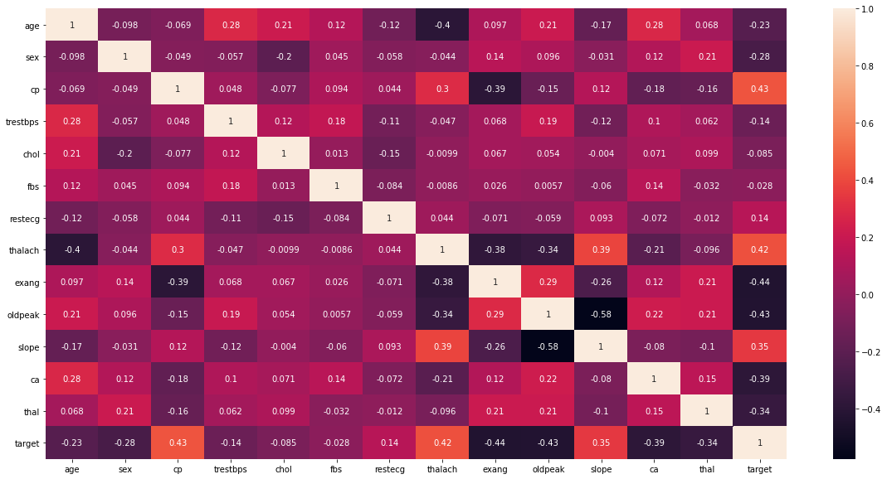

```python
from google.colab import drive
drive.mount('/content/drive')
```

    Mounted at /content/drive


<a href="https://www.kaggle.com/ronitf/heart-disease-uci">Heart DataSet</a>


```python
import matplotlib.pyplot as mplt
import numpy as np
import numpy.linalg as nplinalg
import pandas as pd
import seaborn as sns
import sklearn as skl
from sklearn.linear_model import LinearRegression
from sklearn.metrics import mean_squared_error
from sklearn.model_selection import train_test_split
from sklearn.preprocessing import MinMaxScaler, StandardScaler
```


```python
print(f"Numpy version is {np.__version__}.")
print(f"Pandas version is {pd.__version__}.")
print(f"Seaborn version is {sns.__version__}.")
print(f"Sklearn version is {skl.__version__}.")
```

    Numpy version is 1.19.2.
    Pandas version is 1.2.3.
    Seaborn version is 0.11.1.
    Sklearn version is 0.24.1.


```python
dataset = "D:\Datasets\Heart_Disease_UCI\heart.csv"
heart_df = pd.read_csv(dataset,delimiter= ",")
x = heart_df.copy()
y = x.pop('restecg')
```


```python
print(f"The number of observations is {heart_df.shape[0]}, and the number of variables is {heart_df.shape[1]}")
```

    The number of observations is 303, and the number of variables is 14


## Exploratory Analysis


```python
heart_matrix = heart_df.corr()
mplt.figure(figsize= (20,10))
ax = sns.heatmap(heart_matrix, annot= True)
mplt.show()
```





```python
X_b = x.copy()
X_b.insert(0,'Ones',1)
X_b.head()
```


<div>
<style scoped>
    .dataframe tbody tr th:only-of-type {
        vertical-align: middle;
    }

    .dataframe tbody tr th {
        vertical-align: top;
    }

    .dataframe thead th {
        text-align: right;
    }
</style>
<table border="1" class="dataframe">
  <thead>
    <tr style="text-align: right;">
      <th></th>
      <th>Ones</th>
      <th>age</th>
      <th>sex</th>
      <th>cp</th>
      <th>trestbps</th>
      <th>chol</th>
      <th>fbs</th>
      <th>thalach</th>
      <th>exang</th>
      <th>oldpeak</th>
      <th>slope</th>
      <th>ca</th>
      <th>thal</th>
      <th>target</th>
    </tr>
  </thead>
  <tbody>
    <tr>
      <th>0</th>
      <td>1</td>
      <td>63</td>
      <td>1</td>
      <td>3</td>
      <td>145</td>
      <td>233</td>
      <td>1</td>
      <td>150</td>
      <td>0</td>
      <td>2.3</td>
      <td>0</td>
      <td>0</td>
      <td>1</td>
      <td>1</td>
    </tr>
    <tr>
      <th>1</th>
      <td>1</td>
      <td>37</td>
      <td>1</td>
      <td>2</td>
      <td>130</td>
      <td>250</td>
      <td>0</td>
      <td>187</td>
      <td>0</td>
      <td>3.5</td>
      <td>0</td>
      <td>0</td>
      <td>2</td>
      <td>1</td>
    </tr>
    <tr>
      <th>2</th>
      <td>1</td>
      <td>41</td>
      <td>0</td>
      <td>1</td>
      <td>130</td>
      <td>204</td>
      <td>0</td>
      <td>172</td>
      <td>0</td>
      <td>1.4</td>
      <td>2</td>
      <td>0</td>
      <td>2</td>
      <td>1</td>
    </tr>
    <tr>
      <th>3</th>
      <td>1</td>
      <td>56</td>
      <td>1</td>
      <td>1</td>
      <td>120</td>
      <td>236</td>
      <td>0</td>
      <td>178</td>
      <td>0</td>
      <td>0.8</td>
      <td>2</td>
      <td>0</td>
      <td>2</td>
      <td>1</td>
    </tr>
    <tr>
      <th>4</th>
      <td>1</td>
      <td>57</td>
      <td>0</td>
      <td>0</td>
      <td>120</td>
      <td>354</td>
      <td>0</td>
      <td>163</td>
      <td>1</td>
      <td>0.6</td>
      <td>2</td>
      <td>0</td>
      <td>2</td>
      <td>1</td>
    </tr>
  </tbody>
</table>
</div>


```python
Theta = np.linalg.inv(X_b.T.dot(X_b)).dot(X_b.T.dot(y))
Theta
```


    array([ 1.28974530e+00, -3.72677752e-03, -8.96972591e-02,  1.78914493e-03,
           -1.91462676e-03, -1.44986900e-03, -7.39303005e-02, -1.13750568e-03,
           -1.77405164e-02,  2.32014116e-02,  7.09841980e-02, -1.57580892e-03,
            4.99716260e-02,  1.07639135e-01])


```python
y_pred = X_b.dot(Theta)
y_pred
```


    0      0.321606
    1      0.530441
    2      0.780444
    3      0.586849
    4      0.494628
             ...   
    298    0.527738
    299    0.542926
    300    0.453410
    301    0.647399
    302    0.459463
    Length: 303, dtype: float64


```python
MSE1 = mean_squared_error(np.squeeze(y_pred),y)
MSE1
```


    0.2583764863261865


```python
RMSE1 = np.sqrt(MSE1)
RMSE1
```


    0.5083074722313125


```python
lin_reg = LinearRegression()
lin_reg.fit(x, y)
lin_reg.intercept_, lin_reg.coef_
```


    (1.2897452979183195,
     array([-0.00372678, -0.08969726,  0.00178914, -0.00191463, -0.00144987,
            -0.0739303 , -0.00113751, -0.01774052,  0.02320141,  0.0709842 ,
            -0.00157581,  0.04997163,  0.10763914]))


```python
predict = lin_reg.predict(x)
```


```python
MSSE2 = np.sqrt(mean_squared_error(np.squeeze(lin_reg.predict(x)),y))
MSSE2
```


    0.5083074722313125


```python
eta = 0.2  # learning rate
n_iterations = 10
m = X_b.shape[0]
np.random.seed(42)
theta = np.random.randn(X_b.shape[1])  # create random initialization for theta

for iteration in range(n_iterations):
    gradients = 2/m * np.transpose(X_b).dot(np.squeeze(X_b.dot(theta)) - np.squeeze(y))
    theta = theta - eta * gradients
```


```python
theta
```


    Ones        3.025399e+42
    age         1.651499e+44
    sex         2.027765e+42
    cp          2.928132e+42
    trestbps    4.001819e+44
    chol        7.650587e+44
    fbs         4.556177e+41
    thalach     4.547161e+44
    exang       9.855246e+41
    oldpeak     3.147732e+42
    slope       4.249699e+42
    ca          2.223166e+42
    thal        7.019415e+42
    target      1.645867e+42
    dtype: float64


```python
M = np.array(X_b)
```


```python
x_scaler = MinMaxScaler()
y_scaler = MinMaxScaler()
X_scaled = x_scaler.fit_transform(M)
y_scaled = y_scaler.fit_transform(y.values.reshape(-1,1))
```


```python
eta = 0.2  # learning rate
n_iterations = 10000
m = X_b.shape[0]
np.random.seed(42)
theta = np.random.randn(X_b.shape[1])  # create random initialization for theta

for iteration in range(n_iterations):
    gradients = 2/m * np.transpose(X_scaled).dot(np.squeeze(X_scaled.dot(theta)) - np.squeeze(y_scaled))
    theta = theta - eta * gradients
```


```python
theta
```


    array([ 0.49671415,  0.04398073, -0.02025286,  0.00395835, -0.0706771 ,
           -0.25778431, -0.03890366,  0.08724815,  0.01883836,  0.1515889 ,
            0.11739467,  0.00192061,  0.17312705,  0.09112636])


```python
X_scaled[:5,:].dot(theta)
```


    array([0.13666039, 0.26210926, 0.36784077, 0.33849218, 0.29285126])


```python
y_scaler.inverse_transform(X_scaled[:5,:].dot(theta).reshape(-1,1))
```


    array([[0.27332077],
           [0.52421852],
           [0.73568154],
           [0.67698436],
           [0.58570252]])


```python
y_scaler.inverse_transform(X_scaled.dot(theta).reshape(-1,1))
```


    array([[0.27332077],
           [0.52421852],
           [0.73568154],
           [0.67698436],
           [0.58570252],
           [0.40896612],
           [0.49630217],
           [0.69285053],
           [0.64813048],
           [0.75528409],
           [0.63606177],
           [0.56493759],
           [0.59640427],
           [0.66357771],
           [0.54176356],
           [0.62422885],
           [0.55426402],
           [0.48083818],
           [0.62247412],
           [0.73124426],
           [0.62290321],
           [0.66727778],
           [0.59467069],
           [0.43818164],
           [0.85225822],
           [0.57499664],
           [0.606705  ],
           [0.67255712],
           [0.39207685],
           [0.37902751],
           [0.70325505],
           [0.80552791],
           [0.63586997],
           [0.34260617],
           [0.69088417],
           [0.55016533],
           [0.48883507],
           [0.77788202],
           [0.61114301],
           [0.50135561],
           [0.58678161],
           [0.49432455],
           [0.69638311],
           [0.47948389],
           [0.48795479],
           [0.5275606 ],
           [0.59568375],
           [0.54598347],
           [0.37363126],
           [0.62460794],
           [0.62079025],
           [0.44206293],
           [0.69034751],
           [0.69479453],
           [0.64700828],
           [0.66650288],
           [0.64503407],
           [0.60280946],
           [0.66372897],
           [0.56368192],
           [0.54691212],
           [0.65038716],
           [0.48050594],
           [0.33513174],
           [0.5518017 ],
           [0.74941858],
           [0.60683133],
           [0.55518045],
           [0.62405158],
           [0.69319367],
           [0.58723255],
           [0.79869282],
           [0.64468693],
           [0.61829803],
           [0.55666139],
           [0.5684758 ],
           [0.52025214],
           [0.65337635],
           [0.58654118],
           [0.69253425],
           [0.60853651],
           [0.51163131],
           [0.59280467],
           [0.49905495],
           [0.47729504],
           [0.37403304],
           [0.74621308],
           [0.69908921],
           [0.65077976],
           [0.5488531 ],
           [0.51826154],
           [0.79496616],
           [0.61632508],
           [0.53301497],
           [0.58766419],
           [0.67601002],
           [0.38738689],
           [0.65151786],
           [0.58291177],
           [0.52831312],
           [0.61177173],
           [0.5733241 ],
           [0.71604112],
           [0.47339335],
           [0.64461   ],
           [0.6044638 ],
           [0.36402108],
           [0.52699921],
           [0.6904355 ],
           [0.63157522],
           [0.51132617],
           [0.77350167],
           [0.64361891],
           [0.74693906],
           [0.56145553],
           [0.66025398],
           [0.59266072],
           [0.7633778 ],
           [0.70972294],
           [0.51081213],
           [0.50592228],
           [0.58084952],
           [0.65620696],
           [0.6422042 ],
           [0.72941268],
           [0.72420451],
           [0.62533715],
           [0.60320126],
           [0.57493356],
           [0.64500278],
           [0.64618123],
           [0.46696764],
           [0.52144796],
           [0.59158827],
           [0.54050393],
           [0.59074375],
           [0.56957704],
           [0.54272575],
           [0.50053975],
           [0.55663803],
           [0.60376498],
           [0.48448598],
           [0.56308064],
           [0.69849831],
           [0.59070498],
           [0.55829797],
           [0.51422996],
           [0.68094946],
           [0.61829587],
           [0.63013336],
           [0.55339646],
           [0.70654215],
           [0.59844646],
           [0.46415749],
           [0.49265875],
           [0.5613076 ],
           [0.59199686],
           [0.6431786 ],
           [0.62983094],
           [0.73762335],
           [0.38637862],
           [0.57845835],
           [0.70869551],
           [0.65249846],
           [0.65249846],
           [0.26420492],
           [0.58086069],
           [0.35932961],
           [0.45742784],
           [0.42109927],
           [0.13077719],
           [0.37873467],
           [0.34942442],
           [0.72719604],
           [0.57598709],
           [0.56645682],
           [0.59305728],
           [0.30306718],
           [0.57929016],
           [0.1149657 ],
           [0.33148419],
           [0.44746751],
           [0.36667066],
           [0.58356307],
           [0.45229306],
           [0.34574714],
           [0.60418263],
           [0.46099026],
           [0.4324593 ],
           [0.60293198],
           [0.43618755],
           [0.55306646],
           [0.48666968],
           [0.49940493],
           [0.49760982],
           [0.3198023 ],
           [0.42315614],
           [0.35721155],
           [0.44788765],
           [0.35787764],
           [0.48985303],
           [0.55203353],
           [0.47957914],
           [0.35433496],
           [0.67861405],
           [0.54402031],
           [0.5156614 ],
           [0.53401719],
           [0.54867808],
           [0.63399128],
           [0.43890141],
           [0.59596719],
           [0.45058342],
           [0.42770391],
           [0.2878286 ],
           [0.37870459],
           [0.41440339],
           [0.44673249],
           [0.49624409],
           [0.44134666],
           [0.42955099],
           [0.54973195],
           [0.26812217],
           [0.30366308],
           [0.56342565],
           [0.49311697],
           [0.38117844],
           [0.50922152],
           [0.32099643],
           [0.44142921],
           [0.41488789],
           [0.23247738],
           [0.36723615],
           [0.2580625 ],
           [0.27499791],
           [0.56765666],
           [0.48265062],
           [0.41450528],
           [0.423991  ],
           [0.47613226],
           [0.48227602],
           [0.28532434],
           [0.26817904],
           [0.3428599 ],
           [0.3094549 ],
           [0.39473776],
           [0.36440458],
           [0.13931208],
           [0.43963202],
           [0.49029389],
           [0.5135254 ],
           [0.3202025 ],
           [0.21688064],
           [0.32125892],
           [0.29889578],
           [0.3148374 ],
           [0.53927865],
           [0.46279267],
           [0.411824  ],
           [0.66063653],
           [0.43527267],
           [0.44035745],
           [0.41418962],
           [0.48169833],
           [0.32595624],
           [0.49247038],
           [0.30980539],
           [0.52323257],
           [0.38388152],
           [0.20314921],
           [0.52859409],
           [0.42144509],
           [0.26093123],
           [0.57762647],
           [0.29412878],
           [0.62014355],
           [0.44269862],
           [0.50348562],
           [0.2702276 ],
           [0.54721227],
           [0.13527606],
           [0.10387536],
           [0.21624505],
           [0.51569598],
           [0.66328396],
           [0.36807697],
           [0.50511282],
           [0.39912467],
           [0.48834639],
           [0.58799009],
           [0.55737483],
           [0.18533201],
           [0.26668663],
           [0.46383219],
           [0.28894741],
           [0.80213272],
           [0.4112158 ],
           [0.09340248],
           [0.43497339],
           [0.4165379 ],
           [0.53268408],
           [0.57648736],
           [0.36285238]])


```python
y_pred = y_scaler.inverse_transform(X_scaled.dot(theta).reshape(-1,1))
```


```python
np.squeeze(y_pred) - y
```


    0      0.273321
    1     -0.475781
    2      0.735682
    3     -0.323016
    4     -0.414297
             ...   
    298   -0.565027
    299   -0.583462
    300   -0.467316
    301   -0.423513
    302    0.362852
    Name: restecg, Length: 303, dtype: float64


```python
(np.squeeze(y_pred) - y)/y
```


    0           inf
    1     -0.475781
    2           inf
    3     -0.323016
    4     -0.414297
             ...   
    298   -0.565027
    299   -0.583462
    300   -0.467316
    301   -0.423513
    302         inf
    Name: restecg, Length: 303, dtype: float64


```python
MSE2 = mean_squared_error(np.squeeze(y_pred),y)
MSE2
```


    0.2663695975068618


```python
RMSE2 = np.sqrt(MSE2)
RMSE2
```


    0.51611006336523


```python

```


```python
/content/drive/MyDrive/Colab Notebooks (1)/HeartsUCI.ipynb
```
